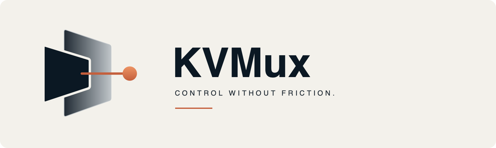

[English](README.md) | [简体中文](README.zh-CN.md)



# KVMux

View and control another computer through a USB capture card and a CH9329
keyboard/mouse controller. Use the hardware directly with **Local**, or attach
it to a relay computer and connect over a trusted LAN with **Remote**. The
target computer does not need KVMux installed.

## What you need

- A USB capture card connected to the target's video output.
- A CH9329 control cable or board, with its serial side connected to the
  computer running KVMux or the relay, and its USB HID side connected to the target.
- A computer running the desktop GUI; Remote also needs a hardware-side relay computer.

```text
Target video output ──> USB capture card ──> KVMux computer
Target USB HID      <── CH9329           <── serial adapter

Local:  KVMux computer runs the desktop GUI
Remote: KVMux computer runs the relay <── LAN ──> desktop GUI
```

This is a hardware KVM, not software screen sharing. Capture modes depend on
your capture card. See the [hardware guide](docs/hardware-validation.md) for
identifying the capture and serial devices.

## Get KVMux

Build from source using the [build guide](docs/building.md). The repository's
[CI](.github/workflows/ci.yml) builds and tests source; it does not publish
installer downloads. You need a C++20 compiler, CMake, Ninja and FFmpeg development
libraries, including avformat. Windows builds require an MSVC developer shell.

On macOS with a C++20 compiler and CMake installed, install Ninja and FFmpeg
with Homebrew, then build Release from the repository root:

```sh
brew install ninja ffmpeg
cmake --preset macos-release
cmake --build --preset macos-release
open build/macos-release/kvmux.app
```

The build guide lists Linux, Windows, Release and headless presets. macOS
Developer ID signing and notarization are not complete. Windows/Linux hardware
coverage, sustained performance and long-session stability remain incomplete;
see the [verification record](docs/acceptance.md) before choosing hardware.

## Use local hardware

1. Connect the capture card and CH9329 serial adapter to the GUI computer.
   On macOS, allow camera access for local capture. On Linux, your user needs
   permission to open the video device and serial port.
2. Open **Connections** and select **Local**. Choose **Capture device** and
   **Capture mode**, then select **Start preview**.
3. Choose **Serial port** and **Baud rate**, then select **Connect**. The default
   is **9600**; use the actual rate configured on your CH9329.
4. Wait for fresh video and ready control. The connection popup closes when
   both are ready. Click the video to capture keyboard and mouse input; this
   first click is not sent to the target.

## Type ASCII text

Use the local text or paste field to enter text, then choose **Type**. This is
an explicit simulated typing action; it does not forward SDL text input.
KVMux accepts only US-keyboard-layout printable ASCII plus Tab and Enter.
It rejects any other character before typing starts and offers a one-click
**Remove unsupported** action that retains the supported US ASCII, Tab, and
Enter characters. Choose **Type** again after removing them. Keep the target
focused and using a US keyboard layout, because the target interprets the
simulated key presses.

Typing is paced and bounded. Cancel it or release input with the usual Host-key,
focus-loss, or connection-release path; KVMux releases active keys and stops
remaining text. Clipboard content stays local and is neither persisted nor
logged. Unicode, Chinese, and Wubi input are not supported yet.

## Capture screenshots and recordings

Open **Media** from the top menu, or from the floating KVMux logo menu. A
screenshot saves the native decoded video only—never menus, the mouse pointer,
or the status overlay—to your system **Downloads** folder as
`kvmux_YYYYMMDD_HHMMSS.jpeg`. If that name already exists, KVMux adds a suffix. In Preview, choose **Select
region screenshot**, drag inside the fitted video, then save. The drag and its
buttons stay local and the saved JPEG contains only the matching source-frame
pixels. For a long page, choose **Select scrolling screenshot**, select the region,
then capture input and scroll downward with the wheel. KVMux samples only the next
fresh frame after each downward wheel event. Use **Finish scrolling screenshot**
to save one JPEG, or cancel with Escape or the Media menu. Version 1 supports only
manual downward vertical scrolling.

Recording saves the same video as an H.264 MP4 in **Downloads**, with the same
time-based name and collision suffix. Use **Start**, **Pause**, **Resume**, and
**Stop**. To record only part of the source video, choose **Select region recording**
and drag the region. KVMux adjusts region-recording edges inward to even source
pixels, as required by H.264 YUV420 encoding. **Stop** waits for the file to finish. Screenshots and recordings stay
local; they are not sent to the target computer.

H.264 MP4 recording requires FFmpeg H.264 support. KVMux shows a clear error if
it is unavailable. Recording uses a bounded latest-frame writer, so it can drop
frames when the computer cannot keep up. This feature has not yet been validated
with physical hardware.

## Connect over LAN

**Use a trusted LAN only.** Remote has no authentication or encryption. Anyone
who can reach the relay ports can attempt to control the target. Do not expose
these ports to the Internet.

1. On the Windows or Linux computer attached to the hardware, build and start
   the relay using the [LAN quick start](docs/lan-relay.md). For a Linux Debug
   headless build with one capture card and one recognized serial adapter:

   ```sh
   build/linux-debug-headless/kvmux-relay --serve
   ```

   If automatic selection fails, use the guide's device-list commands to select
   the capture mode and serial port explicitly.
2. Allow inbound UDP **17000** (control) and **17001** (video) on the relay
   computer, restricted to your intended LAN.
3. In the GUI, open **Connections**, select **Remote**, and enter the relay's
   LAN address in **IPv4 host**. Keep **Control port** and **Video port** at
   `17000` and `17001` unless you changed them on the relay.
4. Select **Connect relay**. Wait for fresh video and ready control, then click
   the video to capture input. Only one controller is supported.

MJPEG pass-through is the default network video format. Raw capture supports four explicit profiles: `--encoding h264-quality|h264-size|h265-quality|h265-size`. See [LAN relay setup](docs/lan-relay.md#choose-h264h265-encoding)
for encoder requirements and the GUI's **Decode** setting.

## Release input and open the menu

Press the **Host key** to return to Preview. It is never sent to the target.
The defaults are **Right Command** on macOS and **Right Control** on Windows/Linux.
In **Connections**, you can instead choose **Host: Right Control** on macOS or
**Host: Right GUI** on Windows/Linux.

The top menu hides while input is captured or recovering. Click the translucent
KVMux logo floating button to release input and open its menu. Drag the button
to move it without sending that drag to the target. In **Relative** mouse mode,
press Host to unlock the pointer first. In fullscreen, move to the top edge
after release to show the top menu. **Status overlay** toggles the bottom metrics;
**Diagnostics** shows connection details. The floating position and overlay
visibility are not saved.

System-reserved shortcuts may stay on your own computer. Use **Send Ctrl+Alt+Del**
or **Send Alt+Tab** in **Connections** when needed. If input stays held after a
serial-link failure, software cannot confirm its release; reconnect the target's
USB HID cable if needed. For video, input or serial problems, see
[LAN troubleshooting](docs/lan-relay.md#troubleshooting-video-appears-but-input-does-not-work).

## Further reading

- [Build options and dependencies](docs/building.md)
- [LAN configuration and troubleshooting](docs/lan-relay.md)
- [Hardware identification](docs/hardware-validation.md) and [verification status](docs/acceptance.md)
- [Technical design](docs/design/kvm-technical-design-v1.md) for contributors
